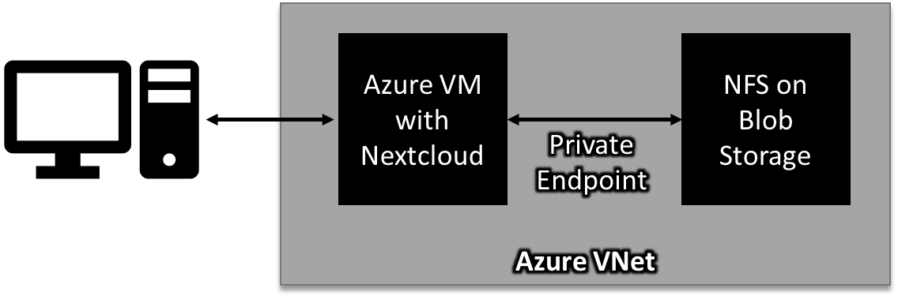

## Setup Nextcloud on Azure with NFS on Blob Storage

Nextcloud provides a private safe place for all your data. The suite of tools and apps works similarly to Dropbox or OneDrive, which allows you to sync your files to the cloud using a client for your phone or PC. It’s also extensible, allowing for features like a calendar, contacts, chat app, and videoconferencing.

What makes Nextcloud stand apart, however, is it does these functions in a private context. Sure, online apps are secure, but when you install Nextcloud, you control who can see your data and who has access to your data without the prying eyes of hosting providers. Therefore, using Nextcloud means having both a secure and private cloud experience.

Setting up Nextcloud on Azure is straightforward if you only use a VM. There are plenty of recipes on how to do that. Using a VM is suboptimal because if you want any sizable storage capacity, you pay for that capacity in allocated drive space, whether you use it or not. Azure has a few services that scale with usage in Azure Files and Azure Blob Storage. Azure Files is conducive for transactional workloads, like databases and apps that need random access to files, but it costs more. Azure Blob Storage is useful for object storage rather than random file access, which is more the pattern used by an app like Nextcloud. 

Historically, you could use Blob Storage with Nextcloud using Blob Fuse. Microsoft more recently introduced NFS for Azure Blob Storage, a much more performant solution for mounting Blob Storage as a part of the file system. NFS, however, has very little inherent security on Azure. Anyone with the endpoint can mount and access the file share, so making any NFS shares on Azure Blob storage a private endpoint and using firewalls built into Azure Storage Accounts and NSGs for VNets to prevent unwanted connections to the private endpoint.

I built these automation scripts to make setting this up on Azure easy. One is an ARM template that deploys a VM, a Storage Account with Blob Storage with NFS enabled, and the private connectivity between the VM and the Storage Account using VNets, Private Endpoints, etc. The shell does three things. First, it mounts the Storage Account into the VM. Second, it sets up Nextcloud and its dependencies on the VM (Apache, MariaDB, PHP, etc.) Third, the script sets up a Let’s Encrypt certificate for the VM.  You can click on the button below to deploy the script using the Azure Portal.

You’ll need a few parameters for this to work:

* User Name: The username  for the VM and for the Nextcloud instance.
* Password: The password for the VM and for the Next cloud instance
* Email: The email address used with Let’s Encrypt.
* DNS Name: The DNS prefix Azure assigns to the public IP and VM. It’s used by Let’s Encrypt to register an SSL with the VM.

Once you deploy the resource, you can navigate to the hostname of the VM: https://yourhost.region.cloudaddp.azure.com

From there, you can log on to your Nextcloud instance and customize it to your heart’s content. Don’t forget the desktop and mobile apps!

